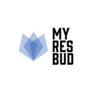
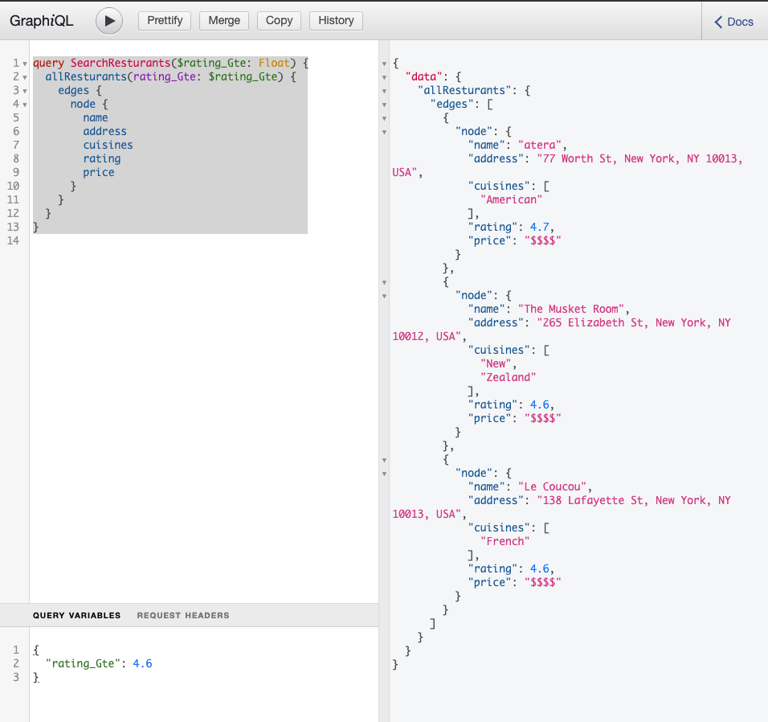
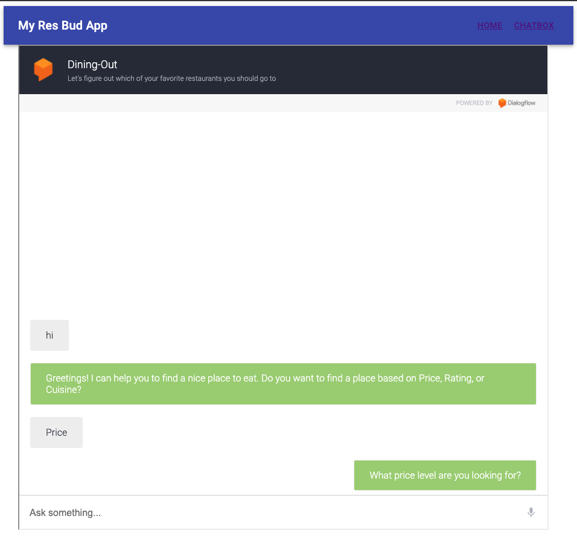
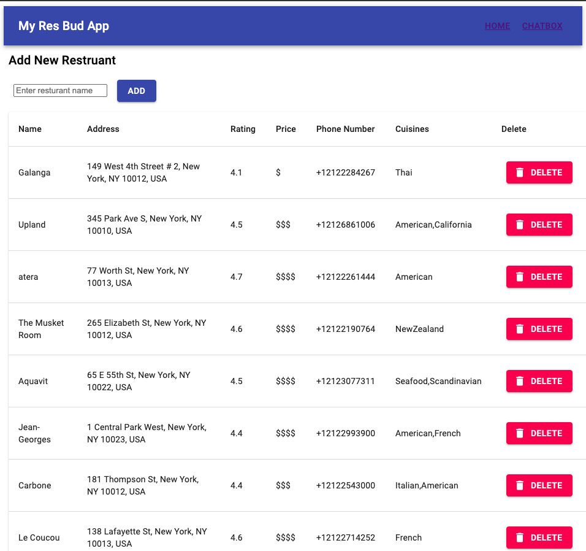

# My Res Bud App

Favorite resturant database and resturant reccomendation chatbot

Deployment Link: TBU

## Summary

- Full stack web application that leverages Django for the backend with a PostgreSQL database and ReactJS for the frontend. The database is interfaced through GraphQL API using both Python and React libaries for schema creation and access. On the frontend the user can perform CRUD operations on thier resturant database through a Material UI table using the GraphQL API layer. On another tab users can interact with a Google DialogFlow chat bot using Google's API and a GraphQl webhook to place queries on the user's database.

- In order to get all the info for the resturants i use both Google and Zomato APIs. When gathering the right cuisine type for a specific resturant i use Levenshtein Distance to decide which item from a list of queriers is the correct resturant if any.

- The chat bot leverages 3 key intents: Query by price, Query by rating, or Query by cusine. These intents are accessed through a welcome context/conversation flow which encodes query entitites based on users response and sends those entities to a webhook which performes a GraphQL query with search and filter functinoality. GraphQl then returns a list or dictionary with the specificied meta data on 5 or less matching entries.

## Technologies

### Tech Stack

#### Backend

- Python
- Django
- PostgreSQL
- GraphQL (Graphene)
- Google Maps API
- Google Dialogflow Webhook (Ngrok in development)
- Zomato API
- FuzzyWuzzy (Levenshtein Distance)

#### Frontend

- ReactJS
- Material UI
- GraphQL (Apollo)
- Google Dialogflow (Chatbot)

## Potential Next Steps

- Deploy and host on public url
- Add Update functionality to frontend dashboard, so users can modify datebase entries using GraphQl mutations
- Add User Authenticaiton, authentication should protect database views so that users can only access entries associated with them whether through the dashboard or chatbot

## Screenshots

#### GraphiQL backend 

#### ChatBot frontend 

#### Dashboard frontend 
